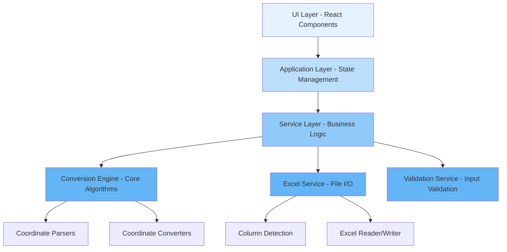
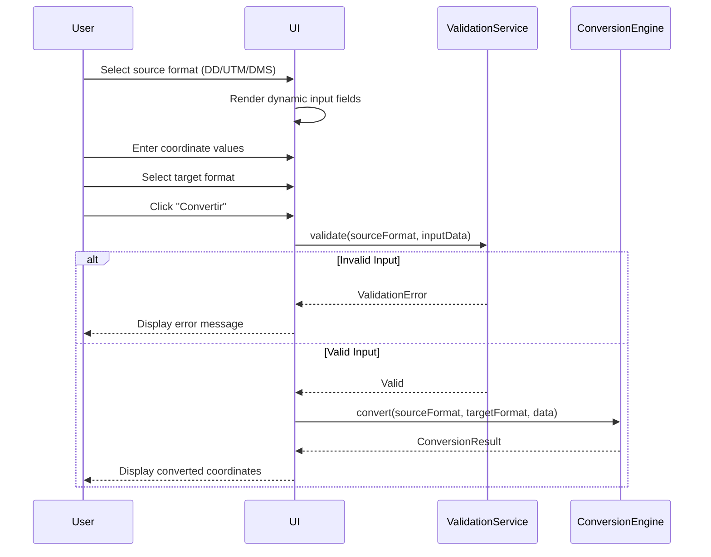
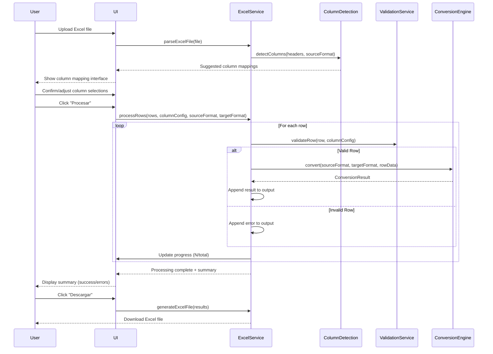

# Design Document: GeoMorph - Coordinate Converter Web Application

## Overview

GeoMorph is a professional, minimalist coordinate conversion web application designed for converting geographic coordinates between three formats: Decimal Degrees (DD), UTM (Universal Transverse Mercator), and Degrees Minutes Seconds (DMS/GMS). The application provides both individual coordinate conversion and bulk Excel file processing capabilities, with intelligent column detection, comprehensive validation, and error handling. Built with a modern, eclectic UI/UX aesthetic, GeoMorph targets professionals who need reliable, high-volume coordinate transformations while maintaining a clean, intuitive interface with Spanish localization.

The architecture follows a modular, layered design separating UI components, business logic, coordinate conversion algorithms, Excel I/O, and validation layers to ensure maintainability, testability, and extensibility.

## Architecture

The system follows a clean, layered architecture with clear separation of concerns:



**Architectural Layers**:

1. **UI Layer**: React components for individual conversion, bulk conversion, column mapping, preview, and results
2. **Application Layer**: State management, navigation flow, progress tracking
3. **Service Layer**: Orchestrates business logic, coordinates between conversion engine, Excel service, and validation
4. **Conversion Engine**: Core coordinate transformation algorithms (DD↔UTM, DD↔DMS, UTM↔DMS)
5. **Excel Service**: File import/export, column detection, data transformation
6. **Validation Service**: Input validation, error message generation

## Sequence Diagrams

### Individual Conversion Flow



### Bulk Excel Conversion Flow




## Components and Interfaces

### Component 1: ConversionEngine

**Purpose**: Core coordinate transformation algorithms supporting bidirectional conversions between DD, UTM, and DMS formats using WGS84/EPSG:4326 datum.

**Interface**:
```pascal
INTERFACE ConversionEngine
  PROCEDURE convertDDtoUTM(latitude, longitude) RETURNS UTMCoordinate
  PROCEDURE convertUTMtoDD(zone, hemisphere, easting, northing) RETURNS DDCoordinate
  PROCEDURE convertDDtoDMS(latitude, longitude) RETURNS DMSCoordinate
  PROCEDURE convertDMStoDD(latDMS, lonDMS) RETURNS DDCoordinate
  PROCEDURE convertUTMtoDMS(zone, hemisphere, easting, northing) RETURNS DMSCoordinate
  PROCEDURE convertDMStoUTM(latDMS, lonDMS) RETURNS UTMCoordinate
END INTERFACE
```

**Responsibilities**:
- Implement geodetically accurate coordinate conversions
- Apply WGS84 ellipsoid parameters for UTM calculations
- Handle hemisphere and zone transitions properly
- Maintain configurable precision (decimal places)
- Return structured coordinate objects

### Component 2: ValidationService

**Purpose**: Validates coordinate inputs against format-specific constraints and generates user-friendly error messages in Spanish.

**Interface**:
```pascal
INTERFACE ValidationService
  PROCEDURE validateDD(latitude, longitude) RETURNS ValidationResult
  PROCEDURE validateUTM(zone, hemisphere, easting, northing) RETURNS ValidationResult
  PROCEDURE validateDMS(degrees, minutes, seconds, direction) RETURNS ValidationResult
  PROCEDURE validateExcelRow(row, columnConfig, sourceFormat) RETURNS ValidationResult
END INTERFACE

STRUCTURE ValidationResult
  isValid: Boolean
  errors: Array of String
END STRUCTURE
```

**Responsibilities**:
- Validate DD: latitude ∈ [-90, 90], longitude ∈ [-180, 180]
- Validate UTM: zone ∈ [1, 60], hemisphere ∈ {N, S}, easting/northing within valid ranges
- Validate DMS: degrees, minutes, seconds within proper bounds, direction ∈ {N, S, E, W}
- Generate localized error messages
- Support row-level validation for bulk processing

### Component 3: ExcelService

**Purpose**: Handles Excel file import/export, column detection, and bulk processing orchestration.

**Interface**:
```pascal
INTERFACE ExcelService
  PROCEDURE parseExcelFile(file) RETURNS ExcelData
  PROCEDURE detectColumns(headers, sourceFormat) RETURNS ColumnSuggestions
  PROCEDURE processRows(rows, columnConfig, sourceFormat, targetFormat, progressCallback) RETURNS ProcessingResult
  PROCEDURE generateExcelFile(originalData, results) RETURNS ExcelFile
END INTERFACE

STRUCTURE ExcelData
  headers: Array of String
  rows: Array of Object
  totalRows: Integer
END STRUCTURE

STRUCTURE ColumnSuggestions
  sourceFormat: String
  suggestedColumns: Object
  confidence: Float
END STRUCTURE

STRUCTURE ProcessingResult
  results: Array of ConversionResult
  summary: ProcessingSummary
END STRUCTURE

STRUCTURE ProcessingSummary
  totalRows: Integer
  successCount: Integer
  errorCount: Integer
  errors: Array of RowError
END STRUCTURE

STRUCTURE RowError
  rowIndex: Integer
  errorMessage: String
END STRUCTURE
```

**Responsibilities**:
- Parse Excel files (.xlsx, .xls) using library (e.g., SheetJS/xlsx)
- Detect columns based on header names with confidence scoring
- Orchestrate bulk conversion with progress callbacks
- Preserve original columns in output
- Generate output Excel with original + COORDENADA_ORIGINAL + COORDENADA_CONVERTIDA + ERROR columns
- Handle errors gracefully without stopping processing

### Component 4: ColumnDetectionService

**Purpose**: Intelligently detects and suggests column mappings based on header names and format requirements.

**Interface**:
```pascal
INTERFACE ColumnDetectionService
  PROCEDURE detectForDD(headers) RETURNS DDColumnMapping
  PROCEDURE detectForUTM(headers) RETURNS UTMColumnMapping
  PROCEDURE detectForDMS(headers) RETURNS DMSColumnMapping
  PROCEDURE scoreColumnMatch(headerName, expectedNames) RETURNS Float
END INTERFACE

STRUCTURE DDColumnMapping
  latitudeColumn: String or Null
  longitudeColumn: String or Null
  confidence: Float
END STRUCTURE

STRUCTURE UTMColumnMapping
  eastingColumn: String or Null
  northingColumn: String or Null
  zoneColumn: String or Null
  hemisphereColumn: String or Null
  confidence: Float
END STRUCTURE

STRUCTURE DMSColumnMapping
  VARIANT SingleColumn(columnName: String)
  VARIANT MultiColumn(
    latDegreesColumn: String,
    latMinutesColumn: String,
    latSecondsColumn: String,
    latDirectionColumn: String,
    lonDegreesColumn: String,
    lonMinutesColumn: String,
    lonSecondsColumn: String,
    lonDirectionColumn: String
  )
  confidence: Float
END STRUCTURE
```

**Responsibilities**:
- Match headers against known patterns (Lat, Latitude, Latitud, Y, Lon, Longitude, X, etc.)
- Support fuzzy matching and case-insensitive comparison
- Calculate confidence scores for suggestions
- Handle both single-column and multi-column DMS formats
- Return null for undetected columns (user must select manually)

### Component 5: CoordinateParser

**Purpose**: Parses coordinate strings in various formats into structured data objects.

**Interface**:
```pascal
INTERFACE CoordinateParser
  PROCEDURE parseDDString(coordinateString) RETURNS Float
  PROCEDURE parseUTMString(coordinateString) RETURNS UTMComponents
  PROCEDURE parseDMSString(coordinateString) RETURNS DMSComponents
END INTERFACE

STRUCTURE UTMComponents
  zone: Integer
  hemisphere: Character
  easting: Float
  northing: Float
END STRUCTURE

STRUCTURE DMSComponents
  degrees: Integer
  minutes: Integer
  seconds: Float
  direction: Character
END STRUCTURE
```

**Responsibilities**:
- Parse flexible DMS formats: "40°25'00.39"N", "40 25 00.39 N", "40° 25' 00.39\" N"
- Extract UTM components from strings like "30T 440000 4470000"
- Handle decimal degree strings with proper locale support
- Throw parsing errors with descriptive messages


## Data Models

### Model 1: DDCoordinate

```pascal
STRUCTURE DDCoordinate
  latitude: Float
  longitude: Float
  precision: Integer
END STRUCTURE
```

**Validation Rules**:
- latitude ∈ [-90, 90]
- longitude ∈ [-180, 180]
- precision ∈ [0, 10], default = 6

### Model 2: UTMCoordinate

```pascal
STRUCTURE UTMCoordinate
  zone: Integer
  band: Character
  hemisphere: Character
  easting: Float
  northing: Float
  precision: Integer
END STRUCTURE
```

**Validation Rules**:
- zone ∈ [1, 60]
- hemisphere ∈ {N, S}
- band ∈ {C, D, E, F, G, H, J, K, L, M, N, P, Q, R, S, T, U, V, W, X}
- easting ∈ [100000, 900000]
- northing ∈ [0, 10000000]
- precision ∈ [0, 10], default = 2

### Model 3: DMSCoordinate

```pascal
STRUCTURE DMSCoordinate
  latitude: DMSComponent
  longitude: DMSComponent
  secondsPrecision: Integer
END STRUCTURE

STRUCTURE DMSComponent
  degrees: Integer
  minutes: Integer
  seconds: Float
  direction: Character
END STRUCTURE
```

**Validation Rules**:
- For latitude: degrees ∈ [0, 90], direction ∈ {N, S}
- For longitude: degrees ∈ [0, 180], direction ∈ {E, W}
- minutes ∈ [0, 59]
- seconds ∈ [0, 60)
- secondsPrecision ∈ [0, 10], default = 3

### Model 4: ConversionConfig

```pascal
STRUCTURE ConversionConfig
  sourceFormat: CoordinateFormat
  targetFormat: CoordinateFormat
  precision: PrecisionConfig
END STRUCTURE

ENUMERATION CoordinateFormat
  DD, UTM, DMS
END ENUMERATION

STRUCTURE PrecisionConfig
  ddPrecision: Integer
  utmPrecision: Integer
  dmsSecondsPrecision: Integer
END STRUCTURE
```

**Validation Rules**:
- sourceFormat ≠ targetFormat
- All precision values ≥ 0

### Model 5: ExcelColumnConfig

```pascal
STRUCTURE ExcelColumnConfig
  sourceFormat: CoordinateFormat
  targetFormat: CoordinateFormat
  columnMapping: ColumnMapping
  fixedValues: FixedValues or Null
END STRUCTURE

STRUCTURE ColumnMapping
  VARIANT DDMapping(latColumn: String, lonColumn: String)
  VARIANT UTMMapping(eastingColumn: String, northingColumn: String, zoneColumn: String or Null, hemisphereColumn: String or Null)
  VARIANT DMSMapping(mapping: DMSColumnMapping)
END STRUCTURE

STRUCTURE FixedValues
  zone: Integer or Null
  hemisphere: Character or Null
END STRUCTURE
```

**Validation Rules**:
- All column names must exist in Excel headers
- For UTM: if zoneColumn is null, fixedValues.zone must be provided
- For UTM: if hemisphereColumn is null, fixedValues.hemisphere must be provided


## Algorithmic Pseudocode

### Main Conversion Algorithm: DD to UTM

```pascal
ALGORITHM convertDDtoUTM(latitude, longitude, precision)
INPUT: latitude (Float), longitude (Float), precision (Integer)
OUTPUT: UTMCoordinate
PRECONDITIONS: latitude ∈ [-90, 90], longitude ∈ [-180, 180], precision ≥ 0
POSTCONDITIONS: Result contains valid UTM coordinates with specified precision

BEGIN
  ASSERT latitude >= -90 AND latitude <= 90
  ASSERT longitude >= -180 AND longitude <= 180
  
  // Step 1: Calculate UTM zone
  zone ← FLOOR((longitude + 180) / 6) + 1
  
  // Step 2: Determine hemisphere
  IF latitude >= 0 THEN
    hemisphere ← 'N'
  ELSE
    hemisphere ← 'S'
  END IF
  
  // Step 3: Calculate UTM band
  band ← calculateUTMBand(latitude)
  
  // Step 4: Convert to radians
  latRad ← latitude * (PI / 180)
  lonRad ← longitude * (PI / 180)
  
  // Step 5: Calculate central meridian
  lonOrigin ← (zone - 1) * 6 - 180 + 3
  lonOriginRad ← lonOrigin * (PI / 180)
  
  // Step 6: WGS84 ellipsoid parameters
  a ← 6378137.0  // Semi-major axis
  e ← 0.0818191908426  // Eccentricity
  k0 ← 0.9996  // Scale factor
  
  // Step 7: Calculate intermediate values
  N ← a / SQRT(1 - e * e * SIN(latRad) * SIN(latRad))
  T ← TAN(latRad) * TAN(latRad)
  C ← (e * e / (1 - e * e)) * COS(latRad) * COS(latRad)
  A ← (lonRad - lonOriginRad) * COS(latRad)
  
  // Step 8: Calculate M (meridional arc)
  M ← calculateMeridionalArc(latitude, a, e)
  
  // Step 9: Calculate easting
  easting ← k0 * N * (A + (1 - T + C) * (A^3 / 6) + 
                      (5 - 18*T + T*T + 72*C - 58*(e*e/(1-e*e))) * (A^5 / 120))
  easting ← easting + 500000.0  // False easting
  easting ← ROUND(easting, precision)
  
  // Step 10: Calculate northing
  northing ← k0 * (M + N * TAN(latRad) * 
                   (A*A/2 + (5 - T + 9*C + 4*C*C) * (A^4/24) + 
                    (61 - 58*T + T*T + 600*C - 330*(e*e/(1-e*e))) * (A^6/720)))
  
  IF hemisphere = 'S' THEN
    northing ← northing + 10000000.0  // False northing for southern hemisphere
  END IF
  northing ← ROUND(northing, precision)
  
  // Step 11: Create result
  result ← UTMCoordinate WITH
    zone: zone,
    band: band,
    hemisphere: hemisphere,
    easting: easting,
    northing: northing,
    precision: precision
  
  ASSERT result.zone >= 1 AND result.zone <= 60
  ASSERT result.easting >= 100000 AND result.easting <= 900000
  ASSERT result.northing >= 0 AND result.northing <= 10000000
  
  RETURN result
END
```

**Loop Invariants**: N/A (no loops in main algorithm)

### Helper Algorithm: Calculate UTM Band

```pascal
ALGORITHM calculateUTMBand(latitude)
INPUT: latitude (Float)
OUTPUT: band (Character)
PRECONDITIONS: latitude ∈ [-80, 84]
POSTCONDITIONS: Returns valid UTM band letter

BEGIN
  bands ← ['C','D','E','F','G','H','J','K','L','M','N','P','Q','R','S','T','U','V','W','X']
  
  IF latitude < -80 OR latitude > 84 THEN
    THROW Error("Latitude outside UTM system range")
  END IF
  
  // Special case for Svalbard
  IF latitude >= 72 AND latitude < 84 THEN
    RETURN 'X'
  END IF
  
  // Calculate band index (8-degree bands starting at -80)
  index ← FLOOR((latitude + 80) / 8)
  
  // Clamp index to valid range
  IF index < 0 THEN index ← 0
  IF index >= LENGTH(bands) THEN index ← LENGTH(bands) - 1
  
  RETURN bands[index]
END
```

### Main Conversion Algorithm: UTM to DD

```pascal
ALGORITHM convertUTMtoDD(zone, hemisphere, easting, northing, precision)
INPUT: zone (Integer), hemisphere (Character), easting (Float), northing (Float), precision (Integer)
OUTPUT: DDCoordinate
PRECONDITIONS: zone ∈ [1,60], hemisphere ∈ {N,S}, easting ∈ [100000,900000], northing ∈ [0,10000000]
POSTCONDITIONS: Result contains valid DD coordinates with specified precision

BEGIN
  ASSERT zone >= 1 AND zone <= 60
  ASSERT hemisphere = 'N' OR hemisphere = 'S'
  ASSERT easting >= 100000 AND easting <= 900000
  ASSERT northing >= 0 AND northing <= 10000000
  
  // Step 1: WGS84 ellipsoid parameters
  a ← 6378137.0
  e ← 0.0818191908426
  k0 ← 0.9996
  
  // Step 2: Remove false easting/northing
  x ← easting - 500000.0
  y ← northing
  IF hemisphere = 'S' THEN
    y ← y - 10000000.0
  END IF
  
  // Step 3: Calculate footpoint latitude
  M ← y / k0
  mu ← M / (a * (1 - e*e/4 - 3*e^4/64 - 5*e^6/256))
  
  e1 ← (1 - SQRT(1 - e*e)) / (1 + SQRT(1 - e*e))
  
  footpointLat ← mu + (3*e1/2 - 27*e1^3/32) * SIN(2*mu) + 
                      (21*e1^2/16 - 55*e1^4/32) * SIN(4*mu) + 
                      (151*e1^3/96) * SIN(6*mu) + 
                      (1097*e1^4/512) * SIN(8*mu)
  
  // Step 4: Calculate intermediate values
  N1 ← a / SQRT(1 - e*e * SIN(footpointLat)^2)
  T1 ← TAN(footpointLat)^2
  C1 ← (e*e / (1-e*e)) * COS(footpointLat)^2
  R1 ← a * (1 - e*e) / (1 - e*e * SIN(footpointLat)^2)^(3/2)
  D ← x / (N1 * k0)
  
  // Step 5: Calculate latitude
  latitude ← footpointLat - (N1 * TAN(footpointLat) / R1) * 
             (D*D/2 - (5 + 3*T1 + 10*C1 - 4*C1*C1 - 9*(e*e/(1-e*e))) * (D^4/24) + 
              (61 + 90*T1 + 298*C1 + 45*T1*T1 - 252*(e*e/(1-e*e)) - 3*C1*C1) * (D^6/720))
  
  latitude ← latitude * (180 / PI)
  latitude ← ROUND(latitude, precision)
  
  // Step 6: Calculate central meridian
  lonOrigin ← (zone - 1) * 6 - 180 + 3
  
  // Step 7: Calculate longitude
  longitude ← (D - (1 + 2*T1 + C1) * (D^3/6) + 
               (5 - 2*C1 + 28*T1 - 3*C1*C1 + 8*(e*e/(1-e*e)) + 24*T1*T1) * (D^5/120)) / 
              COS(footpointLat)
  
  longitude ← lonOrigin + longitude * (180 / PI)
  longitude ← ROUND(longitude, precision)
  
  // Step 8: Create result
  result ← DDCoordinate WITH
    latitude: latitude,
    longitude: longitude,
    precision: precision
  
  ASSERT result.latitude >= -90 AND result.latitude <= 90
  ASSERT result.longitude >= -180 AND result.longitude <= 180
  
  RETURN result
END
```

**Loop Invariants**: N/A (no loops in main algorithm)

### Main Conversion Algorithm: DD to DMS

```pascal
ALGORITHM convertDDtoDMS(latitude, longitude, secondsPrecision)
INPUT: latitude (Float), longitude (Float), secondsPrecision (Integer)
OUTPUT: DMSCoordinate
PRECONDITIONS: latitude ∈ [-90,90], longitude ∈ [-180,180], secondsPrecision ≥ 0
POSTCONDITIONS: Result contains valid DMS coordinates with specified precision

BEGIN
  ASSERT latitude >= -90 AND latitude <= 90
  ASSERT longitude >= -180 AND longitude <= 180
  
  // Step 1: Convert latitude
  latDirection ← IF latitude >= 0 THEN 'N' ELSE 'S'
  latAbs ← ABS(latitude)
  
  latDegrees ← FLOOR(latAbs)
  latMinutesDecimal ← (latAbs - latDegrees) * 60
  latMinutes ← FLOOR(latMinutesDecimal)
  latSeconds ← (latMinutesDecimal - latMinutes) * 60
  latSeconds ← ROUND(latSeconds, secondsPrecision)
  
  // Handle rounding edge case: seconds = 60
  IF latSeconds >= 60 THEN
    latSeconds ← 0
    latMinutes ← latMinutes + 1
    IF latMinutes >= 60 THEN
      latMinutes ← 0
      latDegrees ← latDegrees + 1
    END IF
  END IF
  
  latDMS ← DMSComponent WITH
    degrees: latDegrees,
    minutes: latMinutes,
    seconds: latSeconds,
    direction: latDirection
  
  // Step 2: Convert longitude
  lonDirection ← IF longitude >= 0 THEN 'E' ELSE 'W'
  lonAbs ← ABS(longitude)
  
  lonDegrees ← FLOOR(lonAbs)
  lonMinutesDecimal ← (lonAbs - lonDegrees) * 60
  lonMinutes ← FLOOR(lonMinutesDecimal)
  lonSeconds ← (lonMinutesDecimal - lonMinutes) * 60
  lonSeconds ← ROUND(lonSeconds, secondsPrecision)
  
  // Handle rounding edge case: seconds = 60
  IF lonSeconds >= 60 THEN
    lonSeconds ← 0
    lonMinutes ← lonMinutes + 1
    IF lonMinutes >= 60 THEN
      lonMinutes ← 0
      lonDegrees ← lonDegrees + 1
    END IF
  END IF
  
  lonDMS ← DMSComponent WITH
    degrees: lonDegrees,
    minutes: lonMinutes,
    seconds: lonSeconds,
    direction: lonDirection
  
  // Step 3: Create result
  result ← DMSCoordinate WITH
    latitude: latDMS,
    longitude: lonDMS,
    secondsPrecision: secondsPrecision
  
  ASSERT result.latitude.degrees >= 0 AND result.latitude.degrees <= 90
  ASSERT result.longitude.degrees >= 0 AND result.longitude.degrees <= 180
  ASSERT result.latitude.minutes >= 0 AND result.latitude.minutes < 60
  ASSERT result.longitude.minutes >= 0 AND result.longitude.minutes < 60
  ASSERT result.latitude.seconds >= 0 AND result.latitude.seconds < 60
  ASSERT result.longitude.seconds >= 0 AND result.longitude.seconds < 60
  
  RETURN result
END
```

**Loop Invariants**: N/A (no loops in main algorithm)

### Main Conversion Algorithm: DMS to DD

```pascal
ALGORITHM convertDMStoDD(latDMS, lonDMS, precision)
INPUT: latDMS (DMSComponent), lonDMS (DMSComponent), precision (Integer)
OUTPUT: DDCoordinate
PRECONDITIONS: Valid DMS components with proper constraints
POSTCONDITIONS: Result contains valid DD coordinates

BEGIN
  ASSERT latDMS.degrees >= 0 AND latDMS.degrees <= 90
  ASSERT latDMS.minutes >= 0 AND latDMS.minutes < 60
  ASSERT latDMS.seconds >= 0 AND latDMS.seconds < 60
  ASSERT latDMS.direction IN {'N', 'S'}
  
  ASSERT lonDMS.degrees >= 0 AND lonDMS.degrees <= 180
  ASSERT lonDMS.minutes >= 0 AND lonDMS.minutes < 60
  ASSERT lonDMS.seconds >= 0 AND lonDMS.seconds < 60
  ASSERT lonDMS.direction IN {'E', 'W'}
  
  // Step 1: Convert latitude
  latitude ← latDMS.degrees + (latDMS.minutes / 60) + (latDMS.seconds / 3600)
  
  IF latDMS.direction = 'S' THEN
    latitude ← -latitude
  END IF
  
  latitude ← ROUND(latitude, precision)
  
  // Step 2: Convert longitude
  longitude ← lonDMS.degrees + (lonDMS.minutes / 60) + (lonDMS.seconds / 3600)
  
  IF lonDMS.direction = 'W' THEN
    longitude ← -longitude
  END IF
  
  longitude ← ROUND(longitude, precision)
  
  // Step 3: Create result
  result ← DDCoordinate WITH
    latitude: latitude,
    longitude: longitude,
    precision: precision
  
  ASSERT result.latitude >= -90 AND result.latitude <= 90
  ASSERT result.longitude >= -180 AND result.longitude <= 180
  
  RETURN result
END
```

**Loop Invariants**: N/A (no loops in main algorithm)


### Bulk Processing Algorithm: Process Excel Rows

```pascal
ALGORITHM processExcelRows(rows, columnConfig, sourceFormat, targetFormat, progressCallback)
INPUT: rows (Array of Object), columnConfig (ExcelColumnConfig), sourceFormat (CoordinateFormat), 
       targetFormat (CoordinateFormat), progressCallback (Function)
OUTPUT: ProcessingResult
PRECONDITIONS: rows is non-empty array, columnConfig is valid, sourceFormat ≠ targetFormat
POSTCONDITIONS: All rows processed, results contain success/error for each row

BEGIN
  results ← Empty Array
  successCount ← 0
  errorCount ← 0
  errors ← Empty Array
  totalRows ← LENGTH(rows)
  
  ASSERT totalRows > 0
  ASSERT sourceFormat ≠ targetFormat
  
  // Loop through all rows
  FOR i FROM 0 TO totalRows - 1 DO
    // Loop invariant: All previous rows have been processed
    ASSERT LENGTH(results) = i
    
    row ← rows[i]
    
    TRY
      // Step 1: Extract coordinates from row based on column config
      sourceCoordinate ← extractCoordinateFromRow(row, columnConfig.columnMapping, sourceFormat)
      
      // Step 2: Validate extracted coordinates
      validationResult ← validateCoordinate(sourceCoordinate, sourceFormat)
      
      IF NOT validationResult.isValid THEN
        THROW ValidationError(validationResult.errors[0])
      END IF
      
      // Step 3: Format original coordinate string
      originalString ← formatCoordinateString(sourceCoordinate, sourceFormat)
      
      // Step 4: Convert coordinates
      targetCoordinate ← convertCoordinate(sourceCoordinate, sourceFormat, targetFormat)
      
      // Step 5: Format converted coordinate string
      convertedString ← formatCoordinateString(targetCoordinate, targetFormat)
      
      // Step 6: Create result record
      resultRow ← COPY(row)  // Preserve all original columns
      resultRow.COORDENADA_ORIGINAL ← originalString
      resultRow.COORDENADA_CONVERTIDA ← convertedString
      resultRow.ERROR ← ""
      
      ADD resultRow TO results
      successCount ← successCount + 1
      
    CATCH error
      // Step 7: Handle error for this row
      resultRow ← COPY(row)
      resultRow.COORDENADA_ORIGINAL ← ""
      resultRow.COORDENADA_CONVERTIDA ← ""
      resultRow.ERROR ← error.message
      
      ADD resultRow TO results
      errorCount ← errorCount + 1
      
      errorRecord ← RowError WITH
        rowIndex: i + 2,  // +2 because Excel is 1-indexed and has header row
        errorMessage: error.message
      
      ADD errorRecord TO errors
    END CATCH
    
    // Step 8: Report progress
    IF progressCallback IS NOT NULL THEN
      progress ← (i + 1) / totalRows * 100
      progressCallback(i + 1, totalRows, progress)
    END IF
  END FOR
  
  // Create summary
  summary ← ProcessingSummary WITH
    totalRows: totalRows,
    successCount: successCount,
    errorCount: errorCount,
    errors: errors
  
  // Create final result
  result ← ProcessingResult WITH
    results: results,
    summary: summary
  
  ASSERT LENGTH(results) = totalRows
  ASSERT successCount + errorCount = totalRows
  
  RETURN result
END
```

**Loop Invariants**:
- At iteration i: LENGTH(results) = i (all previous rows have been processed)
- At iteration i: successCount + errorCount = i
- All elements in results preserve original row data plus conversion fields

### Column Detection Algorithm: Detect DD Columns

```pascal
ALGORITHM detectDDColumns(headers)
INPUT: headers (Array of String)
OUTPUT: DDColumnMapping
PRECONDITIONS: headers is non-empty array
POSTCONDITIONS: Returns mapping with confidence score

BEGIN
  ASSERT LENGTH(headers) > 0
  
  // Define pattern arrays for matching
  latitudePatterns ← ["lat", "latitude", "latitud", "y", "northing", "norte"]
  longitudePatterns ← ["lon", "long", "longitude", "longitud", "x", "easting", "este"]
  
  latitudeColumn ← NULL
  longitudeColumn ← NULL
  latBestScore ← 0
  lonBestScore ← 0
  
  // Search for latitude column
  FOR EACH header IN headers DO
    headerLower ← LOWERCASE(header)
    score ← scoreColumnMatch(headerLower, latitudePatterns)
    
    IF score > latBestScore THEN
      latBestScore ← score
      latitudeColumn ← header
    END IF
  END FOR
  
  // Search for longitude column
  FOR EACH header IN headers DO
    headerLower ← LOWERCASE(header)
    score ← scoreColumnMatch(headerLower, longitudePatterns)
    
    IF score > lonBestScore THEN
      lonBestScore ← score
      longitudeColumn ← header
    END IF
  END FOR
  
  // Calculate overall confidence
  IF latitudeColumn IS NOT NULL AND longitudeColumn IS NOT NULL THEN
    confidence ← (latBestScore + lonBestScore) / 2
  ELSE IF latitudeColumn IS NOT NULL OR longitudeColumn IS NOT NULL THEN
    confidence ← 0.5
  ELSE
    confidence ← 0
  END IF
  
  // Create result
  result ← DDColumnMapping WITH
    latitudeColumn: latitudeColumn,
    longitudeColumn: longitudeColumn,
    confidence: confidence
  
  RETURN result
END
```

**Loop Invariants**:
- After each iteration: latBestScore contains highest score found so far for latitude
- After each iteration: lonBestScore contains highest score found so far for longitude
- latitudeColumn and longitudeColumn always contain headers with best scores

### Helper Algorithm: Score Column Match

```pascal
ALGORITHM scoreColumnMatch(headerName, expectedPatterns)
INPUT: headerName (String), expectedPatterns (Array of String)
OUTPUT: score (Float)
PRECONDITIONS: headerName is lowercase, expectedPatterns is non-empty
POSTCONDITIONS: Returns score ∈ [0, 1]

BEGIN
  ASSERT LENGTH(expectedPatterns) > 0
  
  bestScore ← 0
  
  FOR EACH pattern IN expectedPatterns DO
    // Loop invariant: bestScore ≥ 0 and bestScore ≤ 1
    ASSERT bestScore >= 0 AND bestScore <= 1
    
    // Exact match
    IF headerName = pattern THEN
      RETURN 1.0
    END IF
    
    // Contains pattern
    IF CONTAINS(headerName, pattern) THEN
      score ← 0.8
      IF bestScore < score THEN
        bestScore ← score
      END IF
    END IF
    
    // Fuzzy match (Levenshtein distance)
    distance ← levenshteinDistance(headerName, pattern)
    maxLength ← MAX(LENGTH(headerName), LENGTH(pattern))
    
    IF maxLength > 0 THEN
      similarity ← 1 - (distance / maxLength)
      
      IF similarity >= 0.7 THEN
        score ← similarity * 0.6  // Scale down fuzzy matches
        IF bestScore < score THEN
          bestScore ← score
        END IF
      END IF
    END IF
  END FOR
  
  RETURN bestScore
END
```

**Loop Invariants**:
- bestScore always remains in range [0, 1]
- bestScore is monotonically non-decreasing


## Key Functions with Formal Specifications

### Function 1: validateDD()

```pascal
PROCEDURE validateDD(latitude, longitude)
  INPUT: latitude (Float), longitude (Float)
  OUTPUT: ValidationResult
```

**Preconditions:**
- latitude and longitude are numeric values

**Postconditions:**
- Returns ValidationResult with isValid = true if and only if constraints met
- If invalid, errors array contains at least one Spanish error message
- No side effects on input parameters

**Loop Invariants:** N/A

### Function 2: validateUTM()

```pascal
PROCEDURE validateUTM(zone, hemisphere, easting, northing)
  INPUT: zone (Integer), hemisphere (Character), easting (Float), northing (Float)
  OUTPUT: ValidationResult
```

**Preconditions:**
- All parameters are defined (not null)

**Postconditions:**
- Returns ValidationResult with isValid = true if and only if all UTM constraints met
- If invalid, errors array contains descriptive Spanish messages
- No mutations to input parameters

**Loop Invariants:** N/A

### Function 3: convertCoordinate()

```pascal
PROCEDURE convertCoordinate(sourceCoordinate, sourceFormat, targetFormat)
  INPUT: sourceCoordinate (Coordinate), sourceFormat (CoordinateFormat), targetFormat (CoordinateFormat)
  OUTPUT: Coordinate
```

**Preconditions:**
- sourceCoordinate is valid for sourceFormat
- sourceFormat ≠ targetFormat
- sourceFormat, targetFormat ∈ {DD, UTM, DMS}

**Postconditions:**
- Returns valid coordinate in targetFormat
- Conversion is geodetically accurate within precision limits
- No side effects on input coordinate

**Loop Invariants:** N/A

### Function 4: extractCoordinateFromRow()

```pascal
PROCEDURE extractCoordinateFromRow(row, columnMapping, format)
  INPUT: row (Object), columnMapping (ColumnMapping), format (CoordinateFormat)
  OUTPUT: Coordinate
```

**Preconditions:**
- row is non-null object
- All columns specified in columnMapping exist in row
- format is valid CoordinateFormat

**Postconditions:**
- Returns coordinate object of appropriate type for format
- Throws descriptive error if columns missing or values invalid
- No modifications to row object

**Loop Invariants:** N/A

### Function 5: formatCoordinateString()

```pascal
PROCEDURE formatCoordinateString(coordinate, format)
  INPUT: coordinate (Coordinate), format (CoordinateFormat)
  OUTPUT: String
```

**Preconditions:**
- coordinate is valid for given format
- format ∈ {DD, UTM, DMS}

**Postconditions:**
- Returns human-readable string representation
- String follows standard notation for format
- No side effects on coordinate object

**Loop Invariants:** N/A

## Example Usage

### Example 1: Individual DD to UTM Conversion

```pascal
SEQUENCE
  // User input
  latitude ← 40.416775
  longitude ← -3.703790
  
  // Validate input
  validationResult ← validateDD(latitude, longitude)
  
  IF validationResult.isValid THEN
    // Convert
    utmCoord ← convertDDtoUTM(latitude, longitude, 2)
    
    // Display result
    DISPLAY "Zona: " + utmCoord.zone + utmCoord.band
    DISPLAY "Hemisferio: " + utmCoord.hemisphere
    DISPLAY "Este: " + utmCoord.easting + " m"
    DISPLAY "Norte: " + utmCoord.northing + " m"
  ELSE
    DISPLAY "Error: " + validationResult.errors[0]
  END IF
END SEQUENCE
```

### Example 2: Bulk Excel Processing

```pascal
SEQUENCE
  // Upload and parse Excel file
  file ← getUserUploadedFile()
  excelData ← parseExcelFile(file)
  
  // Detect columns for DD source format
  columnSuggestions ← detectColumns(excelData.headers, "DD")
  
  // Display suggestions to user
  DISPLAY "Columnas detectadas:"
  DISPLAY "Latitud: " + columnSuggestions.suggestedColumns.latitudeColumn
  DISPLAY "Longitud: " + columnSuggestions.suggestedColumns.longitudeColumn
  DISPLAY "Confianza: " + (columnSuggestions.confidence * 100) + "%"
  
  // User confirms or adjusts
  columnConfig ← getUserConfirmedConfig(columnSuggestions)
  
  // Process rows with progress callback
  progressCallback ← PROCEDURE(current, total, percent)
    updateProgressBar(percent)
    DISPLAY "Procesando: " + current + " de " + total
  END PROCEDURE
  
  result ← processExcelRows(
    excelData.rows,
    columnConfig,
    "DD",
    "UTM",
    progressCallback
  )
  
  // Display summary
  DISPLAY "Conversión completada:"
  DISPLAY "Total: " + result.summary.totalRows
  DISPLAY "Exitosas: " + result.summary.successCount
  DISPLAY "Errores: " + result.summary.errorCount
  
  IF result.summary.errorCount > 0 THEN
    DISPLAY "Errores encontrados:"
    FOR EACH error IN result.summary.errors DO
      DISPLAY "Fila " + error.rowIndex + ": " + error.errorMessage
    END FOR
  END IF
  
  // Generate and download output file
  outputFile ← generateExcelFile(excelData.rows, result.results)
  downloadFile(outputFile, "coordenadas_convertidas.xlsx")
END SEQUENCE
```

### Example 3: DMS Parsing and Conversion

```pascal
SEQUENCE
  // Parse flexible DMS input
  dmsString ← "40° 25' 00.39\" N, 3° 42' 13.64\" W"
  
  TRY
    latDMS ← parseDMSString("40° 25' 00.39\" N")
    lonDMS ← parseDMSString("3° 42' 13.64\" W")
    
    // Validate
    latValidation ← validateDMS(latDMS.degrees, latDMS.minutes, latDMS.seconds, latDMS.direction)
    lonValidation ← validateDMS(lonDMS.degrees, lonDMS.minutes, lonDMS.seconds, lonDMS.direction)
    
    IF latValidation.isValid AND lonValidation.isValid THEN
      // Convert to DD
      ddCoord ← convertDMStoDD(latDMS, lonDMS, 6)
      
      DISPLAY "Latitud: " + ddCoord.latitude + "°"
      DISPLAY "Longitud: " + ddCoord.longitude + "°"
    ELSE
      DISPLAY "Error de validación"
    END IF
    
  CATCH parseError
    DISPLAY "Error: Formato DMS incorrecto"
  END CATCH
END SEQUENCE
```


## Correctness Properties

### Property 1: Conversion Reversibility

**Statement**: For any valid coordinate, converting from format A to format B and back to format A produces a result within acceptable precision tolerance.

```pascal
PROPERTY conversionReversibility
  FORALL coord IN ValidCoordinates, formatA, formatB IN CoordinateFormats WHERE formatA ≠ formatB:
    LET converted = convert(coord, formatA, formatB)
    LET reversed = convert(converted, formatB, formatA)
    ASSERT withinPrecisionTolerance(coord, reversed, precision)
END PROPERTY
```

### Property 2: Validation Consistency

**Statement**: A coordinate that passes validation for format F can be successfully converted from format F to any other valid format.

```pascal
PROPERTY validationConsistency
  FORALL coord, sourceFormat, targetFormat IN CoordinateFormats WHERE sourceFormat ≠ targetFormat:
    IF validate(coord, sourceFormat).isValid = true THEN
      TRY
        result ← convert(coord, sourceFormat, targetFormat)
        ASSERT result IS NOT NULL
        ASSERT validate(result, targetFormat).isValid = true
      CATCH
        FAIL "Valid coordinate should convert successfully"
      END TRY
    END IF
END PROPERTY
```

### Property 3: Bulk Processing Completeness

**Statement**: Processing N rows always produces exactly N result rows, with each row marked as either success or error.

```pascal
PROPERTY bulkProcessingCompleteness
  FORALL rows IN ExcelRows:
    LET result = processExcelRows(rows, config, sourceFormat, targetFormat, null)
    ASSERT LENGTH(result.results) = LENGTH(rows)
    ASSERT result.summary.successCount + result.summary.errorCount = LENGTH(rows)
    FORALL resultRow IN result.results:
      ASSERT (resultRow.ERROR = "" AND resultRow.COORDENADA_CONVERTIDA ≠ "") OR
             (resultRow.ERROR ≠ "" AND resultRow.COORDENADA_CONVERTIDA = "")
END PROPERTY
```

### Property 4: Column Detection Determinism

**Statement**: For the same set of headers and format, column detection always returns the same suggestions.

```pascal
PROPERTY columnDetectionDeterminism
  FORALL headers IN ArrayOfStrings, format IN CoordinateFormats:
    LET suggestion1 = detectColumns(headers, format)
    LET suggestion2 = detectColumns(headers, format)
    ASSERT suggestion1.suggestedColumns = suggestion2.suggestedColumns
    ASSERT suggestion1.confidence = suggestion2.confidence
END PROPERTY
```

### Property 5: Coordinate Range Preservation

**Statement**: All conversions preserve coordinate validity within proper geographic ranges.

```pascal
PROPERTY coordinateRangePreservation
  FORALL coord, sourceFormat, targetFormat:
    IF validate(coord, sourceFormat).isValid = true THEN
      LET converted = convert(coord, sourceFormat, targetFormat)
      ASSERT validate(converted, targetFormat).isValid = true
      
      // Specifically for DD format
      IF targetFormat = DD THEN
        ASSERT converted.latitude >= -90 AND converted.latitude <= 90
        ASSERT converted.longitude >= -180 AND converted.longitude <= 180
      END IF
      
      // Specifically for UTM format
      IF targetFormat = UTM THEN
        ASSERT converted.zone >= 1 AND converted.zone <= 60
        ASSERT converted.easting >= 100000 AND converted.easting <= 900000
        ASSERT converted.northing >= 0 AND converted.northing <= 10000000
      END IF
    END IF
END PROPERTY
```

### Property 6: Error Message Localization

**Statement**: All error messages are in Spanish and user-friendly (no technical stack traces).

```pascal
PROPERTY errorMessageLocalization
  FORALL validationResult IN ValidationResults:
    IF validationResult.isValid = false THEN
      ASSERT LENGTH(validationResult.errors) > 0
      FORALL errorMsg IN validationResult.errors:
        ASSERT isSpanishText(errorMsg)
        ASSERT NOT containsTechnicalStackTrace(errorMsg)
        ASSERT isUserFriendly(errorMsg)
    END IF
END PROPERTY
```

## Error Handling

### Error Scenario 1: Invalid DD Coordinates

**Condition**: User enters latitude > 90 or < -90, or longitude > 180 or < -180  
**Response**: Display validation error message: "Latitud debe estar entre -90 y 90 grados" or "Longitud debe estar entre -180 y 180 grados"  
**Recovery**: User corrects input values, validation re-runs on conversion attempt

### Error Scenario 2: Invalid UTM Components

**Condition**: User enters zone outside [1, 60], invalid hemisphere, or easting/northing out of valid ranges  
**Response**: Display specific error: "Zona UTM debe estar entre 1 y 60", "Hemisferio debe ser N o S", "Este debe estar entre 100,000 y 900,000 m", "Norte debe estar entre 0 y 10,000,000 m"  
**Recovery**: User corrects invalid component, system re-validates

### Error Scenario 3: Excel File Parsing Failure

**Condition**: Uploaded file is corrupted, empty, or not a valid Excel format  
**Response**: Display error: "Error al leer el archivo Excel. Asegúrese de que es un archivo .xlsx o .xls válido"  
**Recovery**: User uploads different file

### Error Scenario 4: No Columns Detected

**Condition**: Column detection returns confidence = 0 (no matching headers found)  
**Response**: Display warning: "No se detectaron columnas automáticamente. Por favor, seleccione las columnas manualmente" with dropdown selectors  
**Recovery**: User manually selects appropriate columns from dropdown menus

### Error Scenario 5: Missing Required Columns

**Condition**: User proceeds without selecting all required columns for the source format  
**Response**: Display error: "Debe seleccionar todas las columnas requeridas: [list missing columns]"  
**Recovery**: User selects missing columns before proceeding

### Error Scenario 6: Individual Row Conversion Error

**Condition**: During bulk processing, a specific row contains invalid data (e.g., malformed coordinate, out of range value)  
**Response**: Log error for that row, continue processing remaining rows, add descriptive error message to ERROR column  
**Recovery**: No immediate recovery needed; user reviews error summary and can fix source data and re-upload

### Error Scenario 7: DMS Parsing Failure

**Condition**: DMS string doesn't match expected patterns (e.g., "40° 25'", missing seconds, invalid characters)  
**Response**: Display error: "Formato DMS incorrecto. Ejemplo válido: 40° 25' 00.39\" N"  
**Recovery**: User corrects format or uses multi-column DMS input mode

### Error Scenario 8: Zone/Hemisphere Not Specified for UTM

**Condition**: User selects UTM source but doesn't specify zone/hemisphere (neither fixed value nor column selected)  
**Response**: Display error: "Debe especificar la zona y hemisferio UTM, ya sea como valores fijos o seleccionando columnas"  
**Recovery**: User provides zone/hemisphere information


## Testing Strategy

### Unit Testing Approach

**Focus**: Test individual conversion algorithms, validation functions, and parsing logic in isolation.

**Key Test Cases**:

1. **DD to UTM Conversion**:
   - Test known coordinate pairs (e.g., Madrid: 40.416775, -3.703790 → 30T 440720.92 4474814.07)
   - Test boundary cases: equator, prime meridian, zone boundaries
   - Test precision rounding at different decimal places
   - Test southern hemisphere conversions

2. **UTM to DD Conversion**:
   - Test reverse conversion accuracy (compare to original DD within tolerance)
   - Test all zones (1-60)
   - Test northern and southern hemispheres

3. **DD to DMS Conversion**:
   - Test positive and negative coordinates
   - Test rounding edge cases (seconds = 59.999... → 60 → minutes rollover)
   - Test zero values

4. **DMS to DD Conversion**:
   - Test all direction combinations (N/S, E/W)
   - Test zero seconds, minutes, degrees

5. **Validation Functions**:
   - Test boundary values: -90, 90, -180, 180 for DD
   - Test invalid values: 91, -91, 181, -181
   - Test UTM zone boundaries: 0, 1, 60, 61
   - Test hemisphere values: N, S, invalid characters

6. **Column Detection**:
   - Test exact matches: "Latitude", "Longitude"
   - Test case variations: "LATITUDE", "latitude", "Latitude"
   - Test Spanish headers: "Latitud", "Longitud", "Norte", "Este"
   - Test partial matches: "Lat", "Lon", "X", "Y"
   - Test no matches (empty suggestions)

7. **DMS Parsing**:
   - Test various formats: "40°25'00.39\"N", "40 25 00.39 N", "40°25'00.39"N"
   - Test with/without spaces, with/without symbols
   - Test invalid formats

**Coverage Goal**: 90%+ code coverage for core conversion and validation logic

### Property-Based Testing Approach

**Property Test Library**: fast-check (for JavaScript/TypeScript)

**Key Properties to Test**:

1. **Conversion Reversibility**:
   - Generate random valid DD coordinates
   - Convert DD → UTM → DD
   - Assert original and final DD are within precision tolerance
   - Repeat for DD → DMS → DD

2. **Validation Consistency**:
   - Generate random coordinates (both valid and invalid)
   - If validation passes, conversion should succeed
   - If conversion succeeds, result validation should pass

3. **Coordinate Range Invariants**:
   - Generate random valid coordinates
   - Convert to any format
   - Assert result stays within valid ranges

4. **Bulk Processing Completeness**:
   - Generate random Excel rows (N rows)
   - Process with random column config
   - Assert exactly N result rows returned
   - Assert successCount + errorCount = N

5. **Column Detection Stability**:
   - Generate random headers
   - Run detection multiple times
   - Assert identical results each time

**Test Execution**: Run property tests with 1000+ random inputs per property

### Integration Testing Approach

**Focus**: Test complete user workflows end-to-end, including UI interactions, file I/O, and multi-step processes.

**Key Integration Tests**:

1. **Individual Conversion Workflow**:
   - User selects DD as source, enters coordinates
   - User selects UTM as target
   - Click "Convertir"
   - Verify result displayed correctly

2. **Excel Upload and Detection**:
   - User uploads sample Excel file with DD coordinates
   - System detects latitude/longitude columns
   - Verify suggestions displayed in UI
   - User confirms columns
   - Verify preview shows first rows correctly

3. **Bulk Conversion with Errors**:
   - Upload Excel with mix of valid/invalid rows
   - Process conversion
   - Verify progress updates during processing
   - Verify summary shows correct counts
   - Download result file
   - Verify result file contains all original columns + conversion columns
   - Verify error rows have ERROR column populated

4. **Manual Column Selection**:
   - Upload Excel with non-standard headers
   - Manually select columns from dropdowns
   - Process conversion
   - Verify correct columns used

5. **Format Chain Conversions**:
   - Test DD → UTM, UTM → DMS, DMS → DD
   - Verify all paths work correctly

**Test Data**: Prepare sample Excel files with various scenarios (clean data, errors, edge cases, different header formats)

## Performance Considerations

1. **Bulk Processing Optimization**:
   - Process rows asynchronously in batches (e.g., 100 rows at a time) to prevent UI blocking
   - Use Web Workers for heavy computation if processing > 1000 rows
   - Implement streaming for very large files (10,000+ rows)

2. **Progress Tracking**:
   - Update progress bar at regular intervals (e.g., every 50 rows) rather than every row
   - Use throttled progress callbacks to avoid excessive UI updates

3. **Excel File Size Limits**:
   - Set reasonable file size limit (e.g., 10 MB) to prevent memory issues
   - Display warning if file exceeds recommended row count (e.g., 50,000 rows)

4. **Conversion Algorithm Efficiency**:
   - Pre-calculate constants (WGS84 parameters) once, reuse for all conversions
   - Minimize trigonometric function calls where possible
   - Use lookup tables for repetitive calculations if applicable

5. **Column Detection Caching**:
   - Cache detection results to avoid re-running on column config changes
   - Only re-run if headers change

## Security Considerations

1. **File Upload Security**:
   - Validate file type using magic numbers, not just extension
   - Set maximum file size limit (e.g., 10 MB)
   - Scan uploaded files for malicious content if possible
   - Process files in sandboxed environment

2. **Input Sanitization**:
   - Sanitize all user inputs (coordinates, column names) to prevent injection attacks
   - Validate data types strictly (numbers for coordinates, strings for headers)
   - Escape special characters in error messages

3. **Client-Side Processing**:
   - Perform all coordinate conversions client-side (in browser) to avoid transmitting potentially sensitive location data to server
   - If server-side processing is required, use HTTPS and avoid logging coordinate data

4. **Data Privacy**:
   - Don't store uploaded Excel files or coordinate data on server
   - Don't log coordinate values
   - Inform users that processing is done locally

5. **Error Message Safety**:
   - Don't expose internal system details in error messages
   - Avoid stack traces in production
   - Use generic error messages for unexpected failures

## Dependencies

### Core Libraries

1. **Excel Parsing/Generation**:
   - Library: SheetJS (xlsx) or ExcelJS
   - Purpose: Read .xlsx/.xls files, write output files
   - Version: Latest stable

2. **Coordinate Conversion**:
   - Option 1: Proj4js (JavaScript projection library)
   - Option 2: Implement algorithms directly using WGS84 parameters
   - Purpose: UTM coordinate transformations

3. **UI Framework**:
   - Library: React
   - Purpose: Component-based UI development
   - Version: 18.x or latest

4. **UI Components**:
   - Library: Material-UI, Ant Design, or Chakra UI
   - Purpose: Professional, consistent UI components
   - Version: Latest stable

5. **State Management**:
   - Library: React Context + useReducer, or Zustand for simplicity
   - Purpose: Manage application state, conversion config

6. **File Handling**:
   - Library: FileSaver.js
   - Purpose: Trigger file downloads in browser

### Optional Libraries

1. **Progress Indicators**:
   - Library: NProgress or react-circular-progressbar
   - Purpose: Visual progress feedback during bulk processing

2. **Form Validation**:
   - Library: React Hook Form or Formik
   - Purpose: Input validation and form state management

3. **String Similarity**:
   - Library: string-similarity or fastest-levenshtein
   - Purpose: Fuzzy column name matching

4. **Testing**:
   - Jest: Unit testing framework
   - React Testing Library: Component testing
   - fast-check: Property-based testing

### Browser Requirements

- Modern browsers with ES6+ support
- Chrome 90+, Firefox 88+, Safari 14+, Edge 90+
- File API support (FileReader, Blob)
- Web Workers support (optional, for large file processing)
